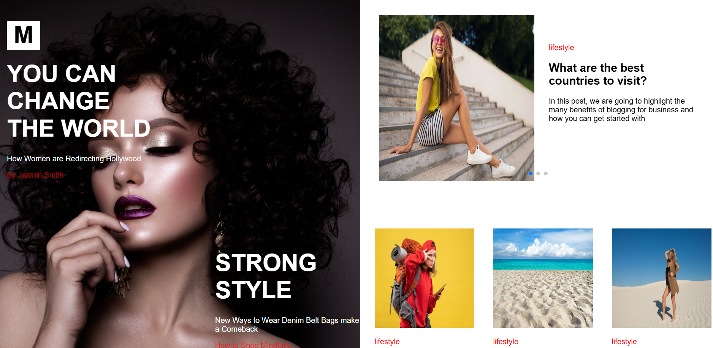

# Blog Website 📝

واجهة مدونة بسيطة وعصرية مبنية باستخدام **React** لعرض مقالات بصفحة جذابة وسهلة التصفح.  
الموقع يعتمد على مكوّنات React القابلة لإعادة الاستخدام ويتميز بتصميم متجاوب يعمل على جميع الأجهزة.

---

## 🔗 Live Demo  
👉 https://blog-w6xe.vercel.app/

## 🗂️ GitHub Repository  
👉 https://github.com/ahmed-moatemed/Blog

---

## 📸 Preview  



---

## 🚀 Features
- تصميم بسيط ونظيف لعرض مقالات المدونة  
- واجهة مبنية بالكامل باستخدام React Components    
- تصميم متجاوب بالكامل (Mobile + Tablet + Desktop)  
- استخدام CSS خفيف ومنسّق لسهولة القراءة  
- سرعة تحميل عالية بفضل هيكل React خفيف

---

## 🛠️ Technologies Used
- **React.js**  
- **CSS3**  
- **Responsive Design**   

---

## 📦 Installation & Run Locally

```bash
# Clone repository
git clone https://github.com/ahmed-moatemed/Blog.git

# Open project folder
cd Blog

# Install dependencies
npm install

# Start development server
npm run dev
```

---

## 📝 Notes
- يمكن تطوير المشروع بإضافة:
  - صفحة لعرض المقال بالكامل (Single Post Page)  
  - التكامل مع API لجلب مقالات حقيقية  
  - نظام تصنيفات (Categories)  
  - شريط بحث للمقالات  
  - صفحة تسجيل دخول للكتاب  
  - Dark Mode

---

## ✨ Author
Developed by **Ahmed Ibrahim Moatemed**  
📧 Email: matamedahmed@gmail.com  
🔗 Portfolio: https://mo3temed.netlify.app/
